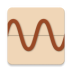
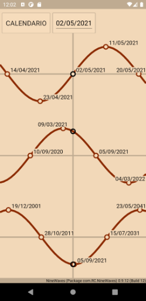
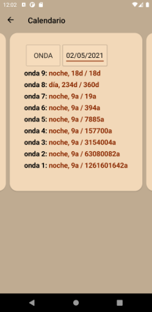

#  NineWaves <!-- omit in toc -->

This cross platform - Linux, Mac OS X and Windows - F# .Net library and smartphone app to chart the nine Maya waves of Carl Johan Calleman. See [Links](#links). It uses [Fabulous](https://fsprojects.github.io/Fabulous/Fabulous.XamarinForms/) as F# MVU (Elm-like) frontend to Xamarin.Forms.

See [YouTube video of the smartphone app](https://youtu.be/JFMrXIghLK4) for a video.




Information about the smartphone app is at [Usage of the Smartphone App](#usage-of-the-smartphone-app)

To interactively try out the F# NuGet package NineWaves, go to the Jupyter Notebook at [](https://mybinder.org/v2/gh/Release-Candidate/NineWaves/main?filepath=NineWaves.ipynb)

Full documentation can be found at [Read the Docs](https://NineWaves.readthedocs.io/en/latest/)


[](https://fsharp.org/)
[](https://dotnet.microsoft.com/download)
[](https://www.nuget.org/packages/NineWaves/)
[](https://ninewaves.readthedocs.io/en/latest/?badge=latest)
[](https://mybinder.org/v2/gh/Release-Candidate/NineWaves/main?filepath=NineWaves.ipynb)
[more badges ...](#badges)

## Table of Content <!-- omit in toc -->

- [Links](#links)
- [Download](#download)
- [Installation and Usage](#installation-and-usage)
  - [Android](#android)
  - [iOS](#ios)
  - [NuGet Package](#nuget-package)
  - [Usage of the Smartphone App](#usage-of-the-smartphone-app)
  - [NineWaves NuGet Package](#ninewaves-nuget-package)
- [Contributing](#contributing)
- [License](#license)
- [Privacy Policy](#privacy-policy)
- [Badges](#badges)
  - [Code coverage](#code-coverage)
  - [GitHub Actions/Workflows](#github-actionsworkflows)

## Links

[Blog of Carl Johan Calleman](https://calleman.com/blog/)

[Experiencing the 9th Wave Influence in your Life](https://calleman.com/experiencing-the-9th-wave-influence-in-our-life/)

## Download

List of changes: [CHANGELOG.md](https://github.com/Release-Candidate/NineWaves/blob/main/CHANGELOG.md)

[Link to the latest release](https://github.com/Release-Candidate/NineWaves/releases/latest)

## Installation and Usage

### Android

Install the package for your smartphone (.apk for Android) onto your phone - search the web
on how you can do that, this depends on your phone

### iOS

I can’t generate an iPhone package myself, so you have to build the project IOS for yourself and
provision the app to your phone. Microsoft has a how-to [here](https://docs.microsoft.com/en-us/xamarin/ios/get-started/installation/device-provisioning/free-provisioning?tabs=macos)

### NuGet Package

Download an install the NineWaves Nuget package using your IDE (Visual Studio or JetBrains Rider) or one of the command-line possibilities: [NineWaves Package at NuGet](https://www.nuget.org/packages/NineWaves/)

In an interactive F# FSI session, you can use the command `#r "nuget: NineWaves"` to download and use the nuget package NineWaves.

### Usage of the Smartphone App

See [YouTube video of the smartphone app](https://www.youtube.com/watch?v=os32KCEqGCk) for a video.

### NineWaves NuGet Package

Download an install the NineWaves Nuget package using your IDE (Visual Studio or JetBrains Rider) or one of the command-line possibilities: [NineWaves Package at NuGet](https://www.nuget.org/packages/NineWaves/)

In an interactive F# FSI session, you can use the command `#r "nuget: NineWaves"` to download and use the nuget package NineWaves.

To use NineWaves in an interactive session:

```F#
#r "nuget: NineWaves"
```

```ps1con
    Installed package NineWaves version 0.9.6
```

Everything is contained in the namespace RC.Maya, so let's open that

```F#
open RC.Maya
```

To check if everything's working, we call `NineWaves.getWaveday9` with the `DateTime` of today (the 2nd of May, 2021), to get the information of the 9th wave for today.

```F#
NineWaves.getWaveday9 System.DateTime.Today
```

```ps1con
    DayNumber  OfDays  WaveNumber  IsNight
           18      18         103     True
```

From the returned `WaveDay` type we can see, that today is the 18th day (`DayNumber`) of 18 days (`OfDays`) of the 103rd 9th wave (`WaveNumber`). Actually it is a 'Night' (`IsNight`), the wave is 'below zero'.

We can do the same with all the other 8 Waves:

```F#
NineWaves.getWaveday8 System.DateTime.Today
```

```ps1con
    DayNumber  OfDays  WaveNumber  IsNight
          234     360          12    False
```

```F#
NineWaves.getWaveday7 System.DateTime.Today
```

```ps1con
    DayNumber  OfDays  WaveNumber  IsNight
         3474    7200           7     True
```

```F#
NineWaves.getWaveday6 System.DateTime.Today
```

```ps1con
    DayNumber  OfDays  WaveNumber  IsNight
         3474  144000           7     True


```F#
NineWaves.getWaveday5 System.DateTime.Today
```

```ps1con
    DayNumber  OfDays  WaveNumber  IsNight
         3474 2880000           7     True
```

```F#
NineWaves.getWaveday4 System.DateTime.Today
```

```ps1con
    DayNumber   OfDays  WaveNumber  IsNight
         3474 57600000           7     True
```

```F#
NineWaves.getWaveday3 System.DateTime.Today
```

```ps1con
    DayNumber     OfDays  WaveNumber  IsNight
         3474 1152000000           7     True
```

```F#
NineWaves.getWaveday2 System.DateTime.Today
```

```ps1con
    DayNumber       OfDays  WaveNumber  IsNight
         3474  23040000000           7     True
```

```F#
NineWaves.getWaveday1 System.DateTime.Today
```

```ps1con
    DayNumber       OfDays  WaveNumber  IsNight
         3474 460800000000           7     True
```

Of course we can use any date, like the 24th of October, 2014:

```F#
NineWaves.getWaveday7 (System.DateTime (2014, 10, 24))
```

```ps1con
    DayNumber  OfDays  WaveNumber  IsNight
         1092    7200           7     True
```

`NineWaves` also contains the 9 sine wave funtions for the nine waves, to generate graphs of. All 9 functions are scaled, so that 0, the wavelength and half wavelength of each wave yields 0, and each day is a integer. The maximum and minimum is reached at `-wavelength / 4` and `wavelength / 4`.

So: for each of the wavelengths we get 0:

```F#
NineWaves.wavefunc9 NineWaves.wavelength9
```

```ps1con
    0
```

```F#
NineWaves.wavefunc8 NineWaves.wavelength8
```

```ps1con
    0
```

```F#
NineWaves.wavefunc7 NineWaves.wavelength7
```

```ps1con
    0
```

And so on ...

Same for the half wavelength:

```F#
NineWaves.wavefunc6 (NineWaves.wavelength6 * 0.5)
```

```ps1con
    -0
```

and of course multiplied by any integer factor:

```F#
NineWaves.wavefunc5 (NineWaves.wavelength5 * -2.)
```

```ps1con
    0
```

```F#
NineWaves.wavefunc4 (NineWaves.wavelength4 * -1.5)
```

```ps1con
    0
```

The maximum of `1` or `-1` is reached at wavelength / 4:

```F#
NineWaves.wavefunc3 (NineWaves.wavelength3 * 0.25)
```

```ps1con
    -1
```

```F#
NineWaves.wavefunc2 (NineWaves.wavelength2 * -0.25)
```

```ps1con
    1
```

```F#
NineWaves.wavefunc1 (NineWaves.wavelength1 * -3.25)
```

```ps1con
    1
```

```F#
NineWaves.wavefunc1 (NineWaves.wavelength1 * -3.75)
```

```ps1con
    -1
```

## Contributing

Any help is welcome!

If you encounter a problem using NineWaves, a task it not as easy as you'd like it to be or you'd like something added to it: open an issue at GitHub, see section [Report Issues](#report-issues-bugs-and-feature-requests).

See page [Contributing](https://NineWaves.readthedocs.io/en/latest/contributing/) at Read the Docs for a detailed description.

## License

All content except some images of NineWaves is licensed under the MIT license, see file [LICENSE](https://github.com/Release-Candidate/NineWaves/blob/main/LICENSE).

## Privacy Policy

NineWaves does not collect or share any personal information, it does not contain any ads, trackers or in-app-payments. See: [Privacy Policy](https://github.com/Release-Candidate/NineWaves/blob/main/privacy_policy.md)

## Badges

### Code coverage

[](https://codecov.io/gh/Release-Candidate/NineWaves)

### GitHub Actions/Workflows

[](https://github.com/Release-Candidate/NineWaves/actions/workflows/osx_test.yml)
[](https://github.com/Release-Candidate/NineWaves/actions/workflows/linux_test.yml)
[](https://github.com/Release-Candidate/NineWaves/actions/workflows/windows_test.yml)
