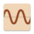

#  NineWaves <!-- omit in toc -->

This cross platform - Linux, Mac OS X and Windows - F# .Net library and smartphone app converts Maya Tzolk’in dates to Gregorian dates and vice versa.

If you want to know more about the Maya calendar systems, see [Links](#links).

Information about the smartphone app is at [Usage of the Smartphone App](#usage-of-the-smartphone-app)

To interactively try out the F# NuGet package NineWaves, go to the Jupyter Notebook 

Full documentation can be found at [Read the Docs](https://NineWaves.readthedocs.io/en/latest/)

[more badges ...](#badges)

## Table of Content <!-- omit in toc -->

- [Links](#links)
- [Download](#download)
- [Installation and Usage](#installation-and-usage)
  - [Usage of the Smartphone App](#usage-of-the-smartphone-app)
  - [NineWaves NuGet Package](#NineWaves-nuget-package)
    - [Install Package & Basic Usage](#install-package--basic-usage)
- [Contributing](#contributing)
- [License](#license)
- [Privacy Policy](#privacy-policy)
- [Badges](#badges)
  - [Code coverage](#code-coverage)
  - [GitHub Actions/Workflows](#github-actionsworkflows)

## Links

## Download

List of changes: [CHANGELOG.md](https://github.com/Release-Candidate/NineWaves/blob/main/CHANGELOG.md)

[Link to the latest release](https://github.com/Release-Candidate/NineWaves/releases/latest)

## Installation and Usage

### Usage of the Smartphone App

See [YouTube video of the smartphone app](https://www.youtube.com/watch?v=os32KCEqGCk) for a video.

### NineWaves NuGet Package

#### Install Package & Basic Usage

## Contributing

Any help is welcome!

If you encounter a problem using NineWaves, a task it not as easy as you'd like it to be or you'd like something added to it: open an issue at GitHub, see section [Report Issues](#report-issues-bugs-and-feature-requests).

See page [Contributing](https://NineWaves.readthedocs.io/en/latest/contributing/) at Read the Docs for a detailed description.

## License

All content except some images of NineWaves is licensed under the MIT license, see file [LICENSE](https://github.com/Release-Candidate/NineWaves/blob/main/LICENSE).

## Privacy Policy

NineWaves does not collect or share any personal information, it does not contain any ads, trackers or in-app-payments. See: [Privacy Policy](https://github.com/Release-Candidate/NineWaves/blob/main/privacy_policy.md)

## Badges

### Code coverage

### GitHub Actions/Workflows

