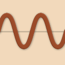

#  NineWaves

This cross platform - Linux, Mac OS X and Windows - F# .Net library and smartphone app to chart the nine Maya waves of Carl Johan Calleman.

If you want to know more about the Maya calendar systems, see [Links](#links).

Information about the smartphone app is at [Usage of the Smartphone App](./usage.md)

Information about the usage of the F# NuGet library NineWaves you find at [NuGet Package](./nuget_package.md).
To interactively try out the F# NuGet package NineWaves, go to the Jupyter Notebook at 

[Contributing](./contributing.md) has information about how to contribute to NineWaves, by
filing bug reports or feature requests, to contributing source code, to adding documentation
or translations or any other way you can help NineWaves.

## Links

[Blog of Carl Johan Calleman](https://calleman.com/blog/)

[Experiencing the 9th Wave Influence in your Life](https://calleman.com/experiencing-the-9th-wave-influence-in-our-life/)
