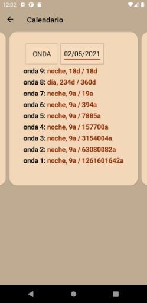

# Installation & Usage

## Installation

### Android

Install the package for your smartphone (`.apk` for Android) onto your phone - search the web
on how you can do that, this depends on your phone

### iOS

I can't generate an iPhone package myself, so you have to build the project `IOS` for yourself and
provision the app to your phone. Microsoft has a how-to [here](https://docs.microsoft.com/en-us/xamarin/ios/get-started/installation/device-provisioning/free-provisioning?tabs=macos)

### Downloads

Download the latest release: [Release at GitHub](https://github.com/Release-Candidate/NineWaves/releases/latest)

## Usage of the Smartphone App

See [YouTube video of the smartphone app](https://youtu.be/JFMrXIghLK4) for a video.

Screenshots:

